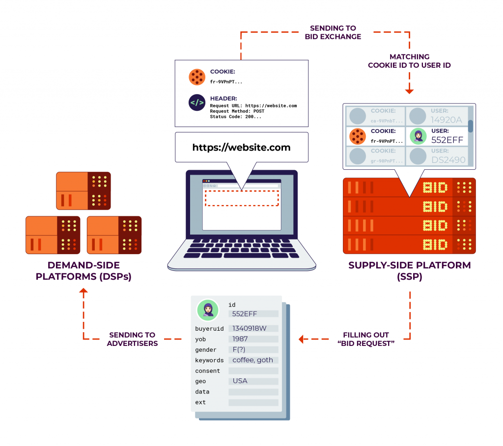
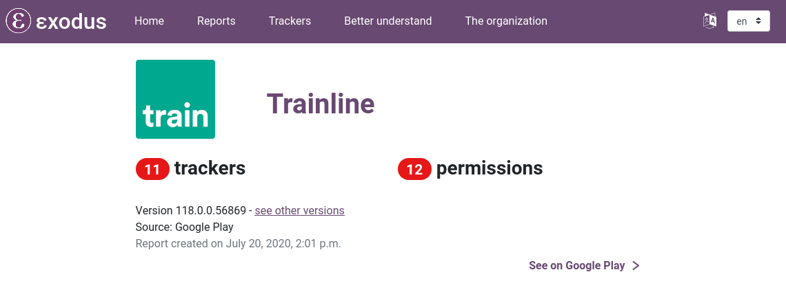
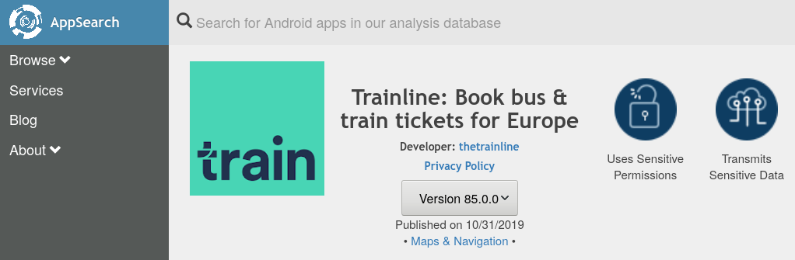

# App Privacy

This chapter provides a brief overview of the most important concepts of user privacy in apps. The concept of app tracking is discussed, as well as real-time bidding and the failed privacy tool 'do not track', to show the helplessness of user, and the responsibility of developers to act.

## App Tracking

In January 2020, the Norwegian Consumer Council, an NGO, published a report on collection and sharing of personal data in popular apps. The reassuring title: “[Out of Control: How Consumers Are Exploited by the Online Advertising Industry](https://fil.forbrukerradet.no/wp-content/uploads/2020/01/2020-01-14-out-of-control-final-version.pdf)”. On 186 pages, the researchers analysed the data practices of 10 popular Android apps. Amongst those apps: a children’s app, a period tracker, and various dating apps. What they found was a blatant disregard for governing data protection legislation, notably the EU General Data Protection Regulation (GDPR).

### Vulnerable groups at risk

*Grindr*, a popular LGBTQ dating app, showed particularly troublesome data practices, for which reason it was singled out in the report. The app was found to share users’ *exact location, IP address, phone ID, age, and gender directly* with 18 third-party companies—including Google Crashlytics, Google Firebase, Tencent, Facebook, and Twitter’s MoPub. To make matters worse, many of these companies reserve the right to pass this data on to many others in a “cascading data sharing” process. In consequence, potentially thousands of companies can get access to this private information.

In fact, the app was found to employ so-called real-time bidding, by which advertising space on a user’s device is sold to interested advertisers in real-time. To facilitate these auctions, the app developer provides the interested advertisers with information about its users. I explain this business model in depth **a later chapter**.

### We’ve been there..

Grindr has faced similar accusations in the past. Users can indicate on their profile whether they are HIV positive or negative, when they were last tested for STIs, and whether or not they take preventive medication against HIV. Previously, Grindr was found to share this medical information with two major analytics companies, only to analyse and improve app usage, they claim. This can put individuals at severe risk.

Homosexuality is illegal in more than 70 countries, in 13 of which it may be punished by death. Alone the use of Grindr, an indicator of sexual orientation, may motivate discrimination or prosecution. Even in countries without repressive legislative regimes, people are put at risk. Some people prefer not to disclose their sexual orientation publicly, and may face discrimination. Grindr only put an end to sharing health information following an official complaint by the Norwegian Consumer Council.

### We’re all affected.

Grindr maintains to “operate with industry standard practices”. This is true. Similar extents of data sharing were found in many other (dating) apps. Tinder, a dating app, was found to share users’ GPS location and “target gender”—or data on sexual orientation. In addition to this information, OkCupid, another dating app, shared data on sexuality, political views and drug use with the analytics company Braze.

Concerning data practices were also found in the analysed children’s and period tracker apps. One can thus very well describe the app ecosystem as “out of control”. Overall, the bespoke report found widespread violations of data protection legislation. Data is shared, without the user’s awareness, let alone consent.

## The dangers of real-time bidding

On average, a person sees over 1 700 online ads per month. A significant proportion of these ads are disseminated using so-called *real-time bidding* (RTB). Whilst the entire online advertising market has a size of 240bn USD, RTB only attracted 5bn USD in spending (1.8%) in 2018. However, RTB is mainly used to sell low-quality ads on otherwise unused desktop and mobile display space. As a result, the proportion of RTB amongst the overall number of online ads may well be higher than 1.8%. Unfortunately, there are no figures readily available, with RTB being a rather new technology. Spread and novelty of RTB motivate a closer look.

In RTB, advertising space on a user’s device is sold via real-time auctions. These auctions are managed by *ad exchanges*. Essentially, ad exchanges apply the concept of eBay to online advertising space. Prominent ad exchanges are Google’s DoubleClick, Microsoft Advertising, and Twitter’s MoPub.

The user (“supply side”) provides the advertising display space on their desktop or mobile device, whilst the advertiser (“demand side”) is interested in buying this display space. The auction proceeds as follows: The user’s device requests an ad from an *ad exchange* (“supply-side platform”), a platform for ad auctions. This request usually contains additional data, such as visited website, user identifiers, phone number, or location. The ad exchange may *enrich the data* received from the user with further data, and then contact interested bidders (“bid request”). The bidders (“demand-side platforms”) receive this information about the user and may make a bid to purchase the offered advertising space on the user’s device. Bidders usually have less than 100ms to respond, after which the auction ends. The highest-paying ad is shown to the user.

The whole process from requesting till serving an ad takes about 200ms.

Real-time bidding comes with severe privacy issues for the user. The real “supply” is the user data, according to which the ads are served. This user data is usually exposed to hundreds of advertisers, that can follow users around the internet and build comprehensive profiles. Moreover, this approach to online advertising relies to a large extent on inferences. Inferences are prone to false assumptions and may raise further issues, such as discrimination. Lastly, what is sold on ad exchanges is not only advertising space, but also the user’s attention.

The questionable practices are currently being investigated by the UK Data Protection Regulator, the ICO, which has announced to [take further action](https://ico.org.uk/about-the-ico/news-and-events/news-and-blogs/2020/01/blog-adtech-the-reform-of-real-time-bidding-has-started/) against advertising companies, which “have their heads firmly in the sand”.

**Further reading:**

- Electronic Frontier Foundation: “Behind the One-Way Mirror: A Deep Dive Into the Technology of Corporate Surveillance”, 2019, https://www.eff.org/wp/behind-the-one-way-mirror

## How is my app doing?

If you're curious now how your app is doing, look no further! There are a couple of tools online that help provide some insights into the privacy of Android apps.

### Exodus Privacy

[Exodus Privacy](https://reports.exodus-privacy.eu.org/en/) is an ambitious project by a group around French app privacy advocates. This group tries to create a database of the whole app tracking ecosystem. They provide the tools to analyse apps for privacy aspects, cultivate a database of relevant privacy characteristics, and regularly scan the most popular Android apps for privacy aspects with their tools.

At the time of writing, their database comprises 304 tracker companies, with which apps have been found to share data. They have analysed 76&nbsp;530 Android apps. You can [search for your app on their website](https://reports.exodus-privacy.eu.org/en/reports/), or initiate an analysis if not yet on their database.

If you prefer to keep the results of the analysis private, all tools are open-source, and can be run locally. You can find the analysis tool for your use [on GitHub](https://github.com/Exodus-Privacy/exodus-standalone). It's super simple to use.

### AppCensus

[AppCensus.io](https://search.appcensus.io/) is another ambitious project to scrutinise the privacy of Android apps. Compare to Exodus, these researchers focus more on run-time behaviour on apps, rather than tracking capabilities of apps. As a result, their database provides very detailed insights into actual app behaviour. This data is obtained by running the apps on actual phones (they claim).

Unfortunately, AppCensus is a commercial project, and none of their tools has been published. This means their analysis tools be used by non-affiliated app developers.

### TrackerControl

I, myself, am developing a tool -- called TrackerControl -- to provide insights into app privacy. TrackerControl allows users to monitor and control the widespread, ongoing, hidden data collection in mobile apps about user behaviour ('tracking'). To detect tracking, TrackerControl checks all network traffic against the *Disconnect blocklist*, used and trusted by the Mozilla Firefox browser. Additionally, our in-house blocklist is used, created *from analysing ~1 000 000 apps*!

This approach

- reveals the companies behind tracking,
- allows to block tracking selectively, and
- exposes the purposes of tracking, such as analytics or advertising.

The app also aims to educate about *your rights* under Data Protection Law, such the EU General Data Protection Regulation (GDPR).

Under the hood, TrackerControl uses Android's VPN functionality, to analyse apps' network communications *locally on the Android device*. This is accomplished through a local VPN server, to enable network traffic analysis by TrackerControl. This VPN layer is adopted from NetGuard, a popular Android firewall. Like NetGuard, TrackerControl additionally allows you to block certain DNS requests, e.g. to advertising companies, and to retrieve a log of all network communications. No external VPN server is used, to keep your data safe!

TrackerControl can be downloaded [directly from GitHub](https://github.com/OxfordHCC/tracker-control-android/releases), including automatic checks for updates. Alternatively, the app is available on [F-Droid](https://f-droid.org/packages/net.kollnig.missioncontrol.fdroid), the most popular open-source Android app store. It is also available on the [IzzyOnDroid](https://apt.izzysoft.de/fdroid/index/apk/net.kollnig.missioncontrol) F-Droid Repository. A feature-reduced version is also available on [Google Play](https://play.google.com/store/apps/details?id=net.kollnig.missioncontrol.play).

## Shouldn't users act on privacy, rather than developers?

User privacy is widely neglected. Why then, should you as a developer do things differently? What difference would it make? And then, doesn't the obligation lie with users to take care of their privacy? Unfortunately, users have little choice over how their data is treated, particularly in mobile. The challenge is to strike a balance between users, and those interested in data. Past attempts have failed.

The most notable past attempt was the idea of a “Do-Not-Track” (DNT) setting, emerged in 2009. This system gives users a simple choice to reject and accept online tracking on websites. Despite great ambitions, DNT has failed, whilst the practice of tracking continues. I want to explore with you why, but also how DNT has managed to change user privacy for the better.

### History of implementation

After its first proposal in 2009, the Federal Trade Commission (FTC), which regulates privacy in the US, quickly picked up the idea of DNT. The FTC expressed their backing for DNT as an [effective alternative to failed industry self-regulation](https://www.wired.com/2010/12/ftc-do-not-track/). At the time, the tracking industry was offering a central website to users, to opt-out by setting the right cookies. Since this was unreliable and created further privacy risks, the FTC regarded DNT as a more robust solution to restrict tracking, not relying on cookies.

DNT works by the user’s browser sending a binary value to every website visited. This value, of whether or not tracking is allowed, is sent to a website in the request header, alongside other information such as requested URL. The W3C, responsible for standards on the Internet, started to work towards a common standard from 2011. By 2012, all major browsers had implemented DNT. In this implementation, the user could choose from the browser settings to enable DNT.

### Reasons for failure

The weakest point of DNT is its reliance on the tracking industry. Implementation in all major browsers is not enough. Websites using tracking must also respect the user’s DNT setting. Also, it is not clear what a DNT signal to a website actually means. Must all data collection on a website be stopped? Are certain types of data collection, such as analytics, still allowed?

With a lack of regulatory obligations and standardisation, very few services ever respected DNT. The search giant and largest online advertising company, Google, never implemented support for DNT on their websites or in their analytics tools. Similarly, other big tech companies, including Facebook and Twitter, simply ignore the DNT signal. Instead, browsers were [“just screaming for privacy into a void”](https://gizmodo.com/do-not-track-the-privacy-tool-used-by-millions-of-peop-1828868324), as expressed by the tech magazine *Gizmodo*.

Worryingly, DNT can have unexpected, negative implications for user privacy. Since only a small minority of users ever used the setting, DNT can be used to identify users. This technique called “browser fingerprinting” creates a unique user identify from your individual browser characteristics. If only enough characteristics of your web browser, such as your DNT setting, are combined, this can be used to identify you. You can find out how unique your browser is with INRIA’s [amiunique.org](https://amiunique.org/) service.

Since there were no sufficient [“indications of planned support among user agents, third parties, and the ecosystem at large”](https://github.com/w3c/dnt/commit/5d85d6c3d116b5eb29fddc69352a77d87dfd2310), the W3C stopped their efforts in January 2019. The following month, [Apple removed support for DNT](https://www.fastcompany.com/90308068/how-the-tragic-death-of-do-not-track-ruined-the-web-for-everyone) from their Safari browser.

### Privacy, a binary setting?

Whilst it is easy to blame the failure of DNT on the advertising industry, the issue is arguably more complex than it first seems. Many content creators online, including news outlets, rely on advertising revenue, and so an outright ban of tracking would be devastating for their business models. A black and white setting does not give user a real choice to allow certain types of information sharing. Much controversy was caused by Microsoft choosing to enable DNT by default in their Internet Explorer 10 on Windows 8. Other browsers had left it to their users to find the DNT setting in the depth of browser configurations.

The debate around DNT foremost took place in the US, which lacks a federal privacy law. By contrast, online tracking has long been on thin ice in the EU. According to EU data protection legislation, as little data as possible should be collected (*data minimisation*). Online tracking is widely considered to not be essential and explicit user consent is required. EU Internet users see more consent banners than US ones, given the lack of an established opt-out solution such as DNT.

### The spirit of DNT lives on

Despite the failure of DNT, it managed to change user privacy permanently for the better. Browser manufacturers have realised that a consensual implementation of user privacy without the explicit cooperation of tracking companies will be difficult–unless there are incentives to do so. Instead, Safari and Firefox now resort to *tracker blocking*, that does not rely on tracking companies. Whilst ad blocking has been widely popular for some time, these new anti-tracking solutions do not primarily aim to block ads, but rather to protect user privacy.

Privacy is more complex than the click of a button, and many website owners rely on the evaluation of user behaviour. On both Safari and Firebox, the user can choose different levels of blocking, and disable tracking protection for every site visited. This avoids problems with website breakage due to blocking, affords users higher granularity than previous solutions, and aims for more fairness towards website owners.

### Tracking continues, what’s next for user privacy?

Google Chrome takes the opposite direction than Safari and Firefox. Instead of pushing for increased tracking protection, the company is currently reworking the browser APIs, upon which current ad and tracking blockers rely. This will restrict the number of URLs that can be monitored by browser extensions. This monitoring is currently used to block the connections to known tracker URLs. The official reason for this change is increased performance. Critics expect a profound impediment to current ad and tracking blockers.

Changes to Google Chrome have a large reach. Chrome leads the browser market, being [used by 68% of desktop users](https://gs.statcounter.com/browser-market-share/desktop/worldwide). Safari and Firefox only attract 9% of users each. It is known that Google relies on advertising and data collection. They have a natural interest in limiting ad and tracker blockers. What might be less known to browser users is that the choice of browser is also a choice of privacy.

Overall, this highlights how DNT has failed, but has motivated new solutions against tracking. It also underlines that privacy cannot be taken for granted in the 21st century. We will need to continue the debate, and to seek innovative solutions around user privacy.
